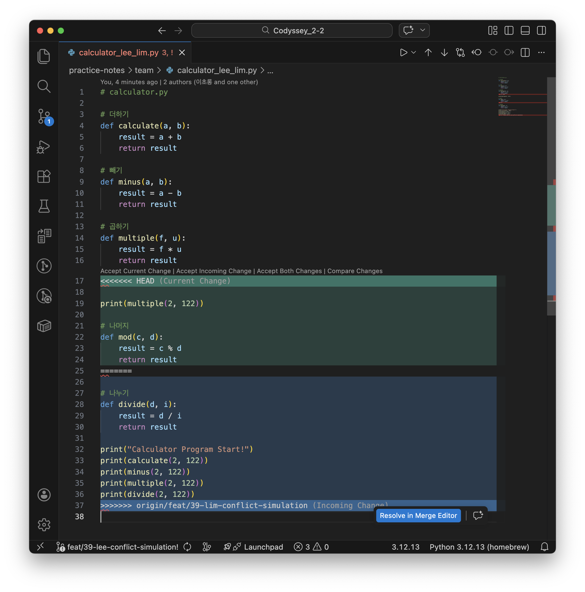

# Conflict Resolution

이 문서는 팀 협업 중 의도적으로 만들고 해결한 Git 충돌 기록을 정리한다. 충돌이 발생한 이유, 해결 절차, 최종 판단 근거를 남겨 이후 같은 문제가 생겼을 때 재현 가능한 참고 자료로 사용한다.

## 충돌 해결 원칙

- 충돌이 발생한 PR 작성자가 1차 해결 담당자가 된다.
- 같은 파일을 수정한 팀원은 각자 변경 의도를 설명한다.
- 충돌 마커(`<<<<<<<`, `=======`, `>>>>>>>`)는 해결 후 반드시 제거한다.
- 한쪽 변경을 무조건 버리지 않고, 두 변경의 목적을 비교해 필요한 내용만 남긴다.
- 해결 후 `git status`, 파일 내용 확인, 문서 링크 확인 등 가능한 검증을 수행한다.
- 해결 과정은 PR 댓글과 이 문서에 함께 남긴다.

## 충돌 마커 의미

```txt
<<<<<<< HEAD
현재 브랜치의 변경 내용
=======
병합하려는 브랜치의 변경 내용
>>>>>>> feature/example
```

- `<<<<<<< HEAD`: 현재 체크아웃된 브랜치의 변경 시작점
- `=======`: 두 브랜치 변경 내용의 구분선
- `>>>>>>> 브랜치명`: 병합 대상 브랜치의 변경 끝점

## 실습 기록 요약

| 번호 | 충돌 유형 | 관련 파일 | 담당자 | 결과 |
| --- | --- | --- | --- | --- |
| 1 | 같은 파일의 인접 라인 수정 | `practice-notes/team/calculator_lee_lim.py` | Lee, Lim | 양쪽 변경 의도를 합쳐 해결 |
| 2 | 파일 이동/이름 변경과 내용 수정 | `practice-notes/team/calculator.py` -> `practice-notes/team/calculator_rename.py` | Park, Son | 새 위치 기준으로 내용 보존 |


## 1. 같은 파일 같은 영역 수정 충돌

### 참여자

- 작성자: Lee
- 리뷰어/공동 수정자: Lim

### 관련 브랜치

- 기준 브랜치: `feat/39-lee-conflict-simulation`
- 작업 브랜치 A: `feat/39-lee-conflict-simulation`
- 작업 브랜치 B: `feat/39-lim-conflict-simulation`

### 관련 파일

- `calculator_lee_lim.py`

### 상황

두 팀원이 `calculator_lee_lim.py`의 같은 위치에 `계산기 기능`을 추가했다. \
한쪽은 `나머지` 기능을 추가했고, 다른 한쪽은 `나누기` 기능을 추가했다. \
두 변경 모두 필요했지만 같은 hunk에 들어가면서 merge 시 충돌이 발생했다.

### 충돌 원인

- 두 브랜치가 같은 파일의 같은 영역을 서로 다르게 수정했다.
- Git은 두 변경 중 어떤 순서와 내용을 최종본으로 선택해야 하는지 자동 판단할 수 없었다.

### 해결 전 예시



### 해결 절차

1. `git status`로 충돌 파일이 `calculator_lee_lim.py`임을 확인했다.
2. 두 브랜치의 변경 목적을 비교했다.
3. `나머지`와 `나누기`가 모두 필요하다고 판단했다.
4. 충돌 마커를 제거했다.
5. 두 섹션을 각각 분리해 최종 `calculator_lee_lim.py` 구조에 반영했다.
6. 링크 경로가 실제 파일 경로와 맞는지 확인했다.
7. `git add calculator_lee_lim.py` 후 충돌 해결 커밋을 생성했다.

### 해결 후 최종 형태

```md
# calculator.py

# 더하기
def calculate(a, b):
    result = a + b
    return result

# 빼기
def minus(a, b):
    result = a - b
    return result

# 곱하기
def multiple(f, u):
    result = f * u
    return result

# 나누기
def divide(d, i):
    result = d / i
    return result

# 나머지
def mod(c, d):
    result = c % d
    return result

print("Calculator Program Start!")
print(calculate(2, 122))
print(minus(2, 122))
print(multiple(2, 122))
print(mod(2, 122))
print(divide(2, 122))
```

### 사용한 명령어

```bash
git pull feat/39-lee-conflict-simulation
git switch feat/39-lee-conflict-simulation
git switch feat/39-lim-conflict-simulation

git status
git add practice-notes/team/calculator_lee_lim.py
git commit -m "feat: ..."

git merge origin/feat/39-lee-conflict-simulation
git commit -m "fix: ..."
```

### 결과

두 팀원의 변경사항을 모두 보존했고, `calculator_lee_lim.py`에서 `나머지` 기능과 `나누기` 기능 모두 확인할 수 있게 되었다.

### 배운 점

- 사전 공유의 중요성: 작업 전 Issue나 PR을 통해 수정 위치를 미리 공유하면 충돌 발생 가능성을 효과적으로 줄일 수 있다.
- 변경 의도의 통합: 충돌 해결은 단순히 한쪽의 코드를 선택해 남기는 것이 아니라, 양측의 변경 목적을 파악하고 조화롭게 합치는 과정이다.
- 꼼꼼한 사후 검증: 해결 후에는 충돌 마커가 깔끔하게 제거되었는지 확인하고, 병합된 코드가 정상적으로 동작하는지 반드시 검증해야 한다.

### 실행 흐름
1. feat/39-`lee`-conflict-simulator 브랜치 생성 (부모 : main)
2. `caculator_lee_lim.py` 초기파일 생성 후 push
3. feat/39-`lim`-conflict-simulator 브랜치 생성 (부모: feat/39-lee-conflict-simulator)
4. lee가 `caculator_lee_lim.py` 내용 수정 후 feat/39-`lee`-conflict-simulator 에 push
5. lim이 `caculator_lee_lim.py` 내용 수정 후 feat/39-`lim`-conflict-simulator 에 push
6. `pr` 생성
7. lee가 feat/39-`lee`-conflict-simulator 에 feat/39-`lim`-conflict-simulator `merge` 시도
8. 충돌 발생 확인
9. 각각 다른 기능 (나머지 연산, 나눗셈 연산) 구현 확인 
10. `충돌 해결`: 마커 제거 및 두 기능 모두 보존되게 수정
11. main에 merge

## 충돌 해결 체크리스트

충돌이 발생하면 아래 항목을 확인한다.

- [x] 어떤 브랜치끼리 충돌이 났는가?
    - 기준 브랜치:feat/29-park-conflict-simulation 
    - 작업 브랜치:feat/29-son-conflict-simulation
    ```bash
    c08022220523@c6r7s8 team % git status
    On branch feat/39-lee-conflict-simulation
    Your branch is up to date with 'origin/feat/39-lee-conflict-simulation'.

    You have unmerged paths.
    (fix conflicts and run "git commit")
    (use "git merge --abort" to abort the merge)

    Unmerged paths:
    (use "git add <file>..." to mark resolution)
            both modified:   calculator_lee_lim.py

    Changes not staged for commit:
    (use "git add <file>..." to update what will be committed)
    (use "git restore <file>..." to discard changes in working directory)
            modified:   ../../docs/conflict-resolution.md

    Untracked files:
    (use "git add <file>..." to include in what will be committed)
            ../../docs/image.png
    ```

- [x] 어떤 파일에서 충돌이 났는가?
    - 기존 파일: `practice-notes/team/calculator.py`
    - 이동 후 파일: `practice-notes/team/calculator_rename.py`

- [x] 충돌 마커를 모두 제거했는가?
    - 네

- [x] 양쪽 변경 의도를 확인했는가?
    - Lee: `practice-notes/team/calculator.py` 파일에 `나머지` 함수 추가
    - Lim: `practice-notes/team/calculator.py` 파일에 `나누기` 함수 추가

- [x] 필요한 변경사항을 모두 보존했는가?
    - 네

- [x] 파일 경로와 링크가 실제 구조와 맞는가?
    - 네
```bash
c08022220523@c6r7s8 team % git branch
* feat/39-lee-conflict-simulation
  feature/11-lee-git-command
  feature/34-lee-git-command-practice
  main
c08022220523@c6r7s8 team % pwd
/Users/08022220523/Documents/Codyssey_2-2/practice-notes/team
```

```bash
jonghan@practice-notes/team % git branch
  feat/39-lee-conflict-simulation
* feat/39-lim-conflict-simulation
  feat/41-lim-study-b2-2
  feat/44-lim-reset---soft-troubleshooting-log
  main
jonghan@practice-notes/team % pwd
/User/jonghan/Codyssey/B2-2-team/practice-notes/team
```
- [x] `git status`에서 unmerged 상태가 사라졌는가?
    - 네
```bash
c08022220523@c6r7s8 git switch feat/39-lee-conflict-simulation
Switched to branch 'feat/29-son-conflict-simulation'
Your branch is up to date with 'origin/feat/39-lee-conflict-simulation'.

c08022220523@c6r7s8 git status
On branch feat/39-lee-conflict-simulation
Your branch is up to date with 'origin/feat/39-lee-conflict-simulation'.
```

- [x] PR 댓글 또는 문서에 해결 과정을 남겼는가?
    - 네


<br>
<br>

## 2. 파일 이동/이름 변경과 내용 수정 충돌

### 참여자

- 작성자: Park
- 리뷰어/공동 수정자: Son

### 관련 브랜치

- 기준 브랜치: `feat/29-park-conflict-simulation`
- 작업 브랜치 A: `feat/29-park-conflict-simulation`
- 작업 브랜치 B: `feat/29-son-conflict-simulation`

### 관련 파일

- 기존 파일: `practice-notes/team/calculator.py`
- 이동 후 파일: `practice-notes/team/calculator_rename.py`

### 상황

Park은 main을 기준으로 `calculator.py`에 새로운 기능 추가를 위해 `feat/29-park-conflict-simulation` 브랜치를 만들었다. 공동 작업자인 Son은 `feat/29-park-conflict-simulation` 브랜치를 기준으로 `feat/29-son-conflict-simulation` 브랜치를 만들고 파일 이름을 `calculator_rename.py`로 변경하고 mulitple 함수를 추가했다.

### 충돌 원인

- 한 브랜치는 파일을 rename했다.
- 다른 브랜치는 rename 전 파일의 내용을 수정했다.
- Git이 수정된 내용을 새 파일명에 자동으로 반영해야 하는지 판단하기 어려운 상황이었다.

### 해결 방향

최종 파일명은 `calculator_rename.py`로 정하고, Son이 수정한 본문 내용은 새 파일에 반영하기로 했다. `calculator.py`는 최종 결과물에는 남기지 않는다.

### 해결 절차

1. `git status`로 rename/delete 또는 both modified 상태를 확인했다.
2. `practice-notes/team/calculator.py`과 `practice-notes/team/calculator_rename.py`의 내용을 비교했다.
3. 최종 파일명은 `calculator_rename.py`로 유지하기로 팀원끼리 합의했다.
4. Son의 본문 수정 내용을 `calculator_rename.py`에 반영했다.
5. 더 이상 필요 없는 `calculator.py`은 추적 대상에서 제거했다.
6. `git add practice-notes/team/calculator_rename.py` 후 충돌 해결 커밋을 생성했다.

### 사용한 명령어

```bash
git switch feat/29-son-conflict-simulation
git merge feat/29-park-conflict-simulation

rm -f calculator.py 
git add calculator_rename.py 
git add calculator.py # rename은 삭제 후 생성 이므로 git status에서 둘다 표시됨
git commit -m "refactor: rename caculator, update logic"
git push
```

### 결과

계산기 파일의 최종 파일명을 `calculator_rename.py`로 정리했고, 기존 파일에 작성된 본문 변경사항도 잃지 않고 보존했다.

### 배운 점

- 파일 이름 변경과 내용 수정은 일반적인 같은 줄 충돌보다 원인 파악이 어렵다.
- rename 작업을 할 때는 PR 설명에 파일 이동 이유를 명확히 적어야 리뷰어가 변경 의도를 이해하기 쉽다.
- 파일 이동 PR은 가능하면 내용 수정과 분리하는 편이 충돌 가능성을 줄인다.

### 실행 흐름
1. feat:/29-park-conflict-simulator 브랜치 생성 (부모 : main)
2. caculator.py 간단한 수정 후 push
3. feat:/29-son-conflict-simulator 브랜치 생성 (부모: feat:/29-park-conflict-simulator)
4. caculator.py 내용 수정 및 rename (caculator.py -> caculator_rename.py) 후 push
5. pr 생성 후 충돌 발생 확인
6. feat:/29-son-conflict-simulator 에서 부모를 merge
7. caculator.py 삭제 (caculator_rename.py 남김)
8. pr 요구사항 수정 후 push
9. pr 생성 후 feat:/29-park-conflict-simulator 에 merge
10. feat:/29-park-conflict-simulator 에서 fetch 후 pull
11. pr 생성 후 main에 merge

## 충돌 해결 체크리스트

충돌이 발생하면 아래 항목을 확인한다.

- [x] 어떤 브랜치끼리 충돌이 났는가?
    - 기준 브랜치:feat/29-park-conflict-simulation 
    - 작업 브랜치:feat/29-son-conflict-simulation

- [x] 어떤 파일에서 충돌이 났는가?
    - 기존 파일: `practice-notes/team/calculator.py`
    - 이동 후 파일: `practice-notes/team/calculator_rename.py`

- [x] 충돌 마커를 모두 제거했는가?
    - 네

- [x] 양쪽 변경 의도를 확인했는가?
    - Park: calculator.py 파일에 뺄셈 함수 추가
    - Son: calculator.py 파일명 변경, 곱셈 함수 추가
    - 최종 파일명은 calculator_rename.py로 유지하며 뺄셈 함수와 곱셈 함수를 추가함.

- [x] 필요한 변경사항을 모두 보존했는가?
    - 네

- [x] 파일 경로와 링크가 실제 구조와 맞는가?
    - 네
```bash
pbk@practice-notes/team# git branch
  docs/28-park-fix-docs
* feat/29-park-conflict-simulation
  feat/29-son-conflict-simulation
  main
pbk@practice-notes/team# pwd
/Users/bumkyu8425/Codyssey_2-2/practice-notes/team
```

```bash
pbk@practice-notes/team# git branch
  docs/28-park-fix-docs
  feat/29-park-conflict-simulation
* feat/29-son-conflict-simulation
  main
pbk@practice-notes/team# pwd
/Users/bumkyu8425/Codyssey_2-2/practice-notes/team
```
- [x] `git status`에서 unmerged 상태가 사라졌는가?
    - 네
```bash
pbk@practice-notes/team# git switch feat/29-park-conflict-simulation
Switched to branch 'feat/29-son-conflict-simulation'
Your branch is up to date with 'origin/feat/29-son-conflict-simulation'.

pbk@practice-notes/team# git status
On branch feat/29-son-conflict-simulation
Your branch is up to date with 'origin/feat/29-son-conflict-simulation'.
```

- [x] PR 댓글 또는 문서에 해결 과정을 남겼는가?
    - 네

## 충돌 예방 규칙

- 같은 파일을 여러 명이 수정할 때는 Issue 댓글이나 PR 설명에 수정 범위를 먼저 공유한다.
- 큰 문서 하나를 여러 명이 동시에 수정해야 하면 섹션별 담당자를 정한다.
- 파일 이동, 파일명 변경, 대량 포맷팅은 별도 PR로 분리한다.
- 작업 시작 전 `main`의 최신 변경사항을 반영한다.
- 충돌 해결 커밋 메시지는 `fix: resolve <대상> conflict` 형식으로 작성한다.
