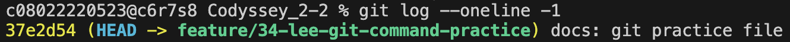
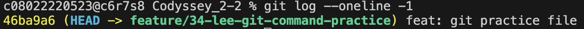
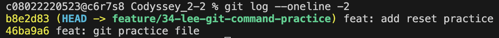
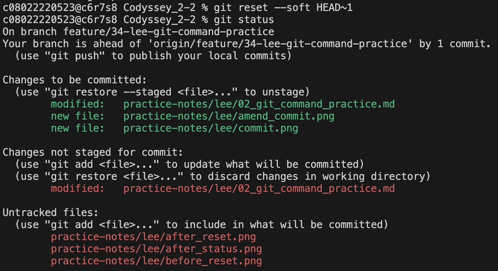
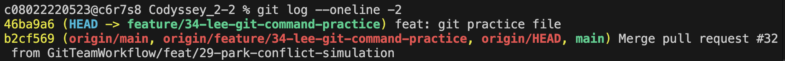

# Git Command Practice

## 개요

이 문서는 Git 협업 실습 시 자주 사용하는 명령어를 직접 실행해 보고,  
각 명령이 어떤 상황에서 사용되는지 정리한 실습 기록이다.

실습 대상 명령어는 다음과 같다.

## 실습 요약

| 명령어 | 목적 | 사용 시점 |
|--------|------|-----------|
| `git commit --amend` | 최근 커밋 수정 | 최근 커밋 메시지/내용 수정 시 |
| `git reset --soft HEAD~1` | 최근 커밋 취소 + 변경 유지 | 로컬 커밋 재정리 시 |
| `git revert` | 특정 커밋 취소용 새 커밋 생성 | 이미 공유된 커밋 취소 시 |
| `git stash` | 작업 내용 임시 저장 | 브랜치 전환 전 |
| `git stash pop` | 임시 저장 내용 복원 | 원래 작업 복귀 시 |

---

## 1. `git commit --amend`

### 목적
가장 최근 커밋의 메시지 또는 커밋 내용을 수정한다.

### 실습 흐름
1. 파일 수정 후 커밋한다.
2. 잘못 작성한 커밋 메시지를 확인한다.
3. `git commit --amend`로 최근 커밋 메시지를 수정한다.
4. 수정된 커밋 로그를 확인한다.

### 실습 명령어

```bash
git status
git add .
git commit -m "docs: git pratice file"
git log --oneline -1
git commit --amend -m "feat: git practice file"
git log --oneline -1
```

### 캡처 포인트
- 첫 커밋 직후 `git log --oneline -1`
    
- amend 실행 후 다시 `git log --oneline -1`
    

### 결과
- 가장 최근 커밋 메시지가 수정된다.
- 새로운 커밋이 추가되는 것이 아니라, 직전 커밋이 변경된다.

### 정리
- 아직 원격 저장소에 push하지 않은 최근 커밋을 정리할 때 유용하다.
- 이미 공유된 커밋에는 신중하게 사용해야 한다.

---

## 2. `git reset --soft HEAD~1`

### 목적
최근 커밋을 취소하되, 변경 내용은 그대로 유지한다.

### 실습 흐름
1. 파일 수정 후 새 커밋을 만든다.
2. 최근 커밋 로그를 확인한다.
3. `git reset --soft HEAD~1`로 최근 커밋을 취소한다.
4. `git status`로 변경 내용이 남아 있는지 확인한다.

### 실습 명령어

```bash
git add .
git commit -m "docs: add reset practice"
git log --oneline -2
git reset --soft HEAD~1
git status
git log --oneline -2
```

### 캡처 포인트
- reset 전 `git log --oneline -2`
    
- reset 후 `git status`
    
- reset 후 `git log --oneline -2`
    

### 결과
- 가장 최근 커밋은 취소된다.
- 파일 수정 내용은 삭제되지 않고 스테이징 상태로 남는다.

### 정리
- 커밋 메시지를 다시 쓰거나 커밋 단위를 나누고 싶을 때 적합하다.
- 아직 원격에 push하지 않은 로컬 커밋 정리에 주로 사용한다.

---

## 3. `git revert`

### 목적
이미 생성된 특정 커밋은 그대로 남아있고, 그걸 취소하는 효과를 가진 새 새 커밋을 만든다.

### 실습 흐름
1. 취소 대상 커밋을 확인한다.
2. `git revert`를 실행한다.
3. 되돌림 커밋이 새로 생성되었는지 확인한다.

### 실습 명령어

```bash
git log --oneline -3
git revert <커밋해시>
git log --oneline -3
```

예시:

```bash
git revert abc1234
```

### 캡처 포인트
- revert 전 `git log --oneline -3`
- revert 후 `git log --oneline -3`

### 결과
- 기존 커밋은 유지된다.
- 해당 변경을 취소하는 새로운 커밋이 추가된다.

### 정리
- 공유 브랜치에서 커밋을 되돌릴 때 적합하다.
- `reset`과 달리 히스토리를 보존하므로 협업 환경에서 더 안전하다.

---

## 4. `git stash`

### 목적
현재 작업 중인 변경 사항을 임시로 보관한다.

### 실습 흐름
1. 파일을 수정한 뒤 아직 커밋하지 않은 상태를 만든다.
2. `git status`로 변경 파일을 확인한다.
3. `git stash`로 작업 내용을 임시 저장한다.
4. 다시 `git status`로 작업 디렉터리가 정리되었는지 확인한다.

### 실습 명령어

```bash
git status
git stash
git status
git stash list
```

### 캡처 포인트
- stash 전 `git status`
- stash 후 `git status`
- stash 후 `git stash list`

### 결과
- 현재 작업 내용이 stash에 저장된다.
- 워킹 디렉터리가 깨끗한 상태로 돌아간다.

### 정리
- 급하게 다른 작업을 처리해야 할 때 유용하다.
- 커밋하지 않은 변경 사항을 잠시 치워둘 수 있다.

---

## 5. `git stash pop`

### 목적
stash에 임시 저장한 작업 내용을 다시 복원한다.

### 실습 흐름
1. stash 목록이 있는 상태를 확인한다.
2. `git stash pop`으로 가장 최근 stash를 복원한다.
3. `git status`로 복원된 파일을 확인한다.
4. `git stash list`로 stash가 제거되었는지 확인한다.

### 실습 명령어

```bash
git stash list
git stash pop
git status
git stash list
```

### 캡처 포인트
- pop 전 `git stash list`
- pop 후 `git status`
- pop 후 `git stash list`

### 결과
- 가장 최근 stash 내용이 작업 디렉터리에 복원된다.
- 복원된 stash 항목은 stash 목록에서 제거된다.

### 정리
- 이전 작업을 이어서 진행할 때 사용한다.
- 복원 후 변경 내용과 충돌 여부를 확인해야 한다.

---

## 6. 실습 후 느낀 점

- `git log`, `git status`, `git stash list`를 함께 확인하면 명령 전후 차이를 이해하기 쉽다.
- `amend`와 `reset`은 로컬 커밋 정리에 적합하다.
- `revert`는 공유된 커밋을 안전하게 취소할 때 적합하다.
- `stash`와 `stash pop`은 작업 전환 상황에서 매우 유용하다.