# 튜토리얼 수행 내역 (실습 기록)

> **작성자:** (이름)
> **수행일:** 2026-06-11
> **무엇:** [`TUTORIAL_GUIDE.md`](./TUTORIAL_GUIDE.md) 의 Lab을 실제로 따라 하며 **친 명령 + 결과 + 캡쳐**를 남긴 기록.
>
> - 지시문(=무엇을 할지) = [`TUTORIAL_GUIDE.md`](./TUTORIAL_GUIDE.md)
> - 이 문서(=내가 실제로 한 것) = 수행 내역/증빙
> - 개념을 내 말로 정리한 것 = [`STUDY_NOTE.md`](./STUDY_NOTE.md)
>
> 캡쳐는 `docs/images/` 에 저장. 환경: macOS / zsh (느낌표 `!` 는 작은따옴표로 처리).

---

## 통과 현황 (한눈에)

| Lab | 주제 | 통과 | 캡쳐 |
| --- | --- | :--: | --- |
| 0 | 샌드박스 셋업 | ✅ | — |
| 1 | init/add/commit/log | ✅ | — |
| 2 | 브랜치·병합 | ✅ | (히스토리 그래프 텍스트) |
| 3 | 충돌(자명, content) | ✅ | `lab3-marker.png`(전), `lab3-after.png`(후), `lab3.png` |
| 4 | 충돌(비자명, modify/delete) | ✅ | `lab4.png` |
| 5 | `reset --soft` | ✅ | `lab5.png` |
| 6 | `revert` | ✅ | `lab6.png` |
| 7 | `stash` / `stash pop` | ✅ | `lab7.png`, `lab7-stashlist.png` |
| 8 | `commit --amend` | ✅ | `lab8.png` |
| 9 | `rebase -i` (squash) | ✅ | `lab9-rebase.png`, `lab9-rebase-after.png` |
| 10 | `reflog` 복구 | ✅ | `lab10.png` |
| 11 | GitHub PR (선택) | ☐ 미실시 | — |

---

## Lab 1~2 — 기본 흐름 / 브랜치·병합
- 친 핵심 명령: `git init` → `add`/`commit` → `git switch -c feature/...` → `git merge`
- 결과: 커밋이 쌓이고, feature 브랜치를 main에 병합. 병합 결과는 아래 전체 히스토리 그래프로 확인.

**📸 `git log --oneline --graph --all` 결과 (텍스트로 기록)**

```text
*   c5303f1 (HEAD -> main) Merge branch 'feature/rename-data'
|\
| * b6ce4ca refactor: rename data.txt to info.txt and edit line A
* | 09af2be feat: edit line A in data.txt
|/
* ec80169 feat: add data.txt
*   5afa23d Merge branch 'feature/rename-utils'
|\
| * b9ff5dd refactor: rename utils.txt to helpers.txt
* | 03cf6bf feat: edit util A in utils.txt
|/
* 77d9ff3 feat: add utils.txt
*   863462a Merge branch 'feature/title-change'
|\
| * d4325d1 docs: set title from feature
* | ca207a6 docs: set title from main
|/
* ... (초기 커밋들)
```

- 알게 된 점: `|\` 로 갈라졌다 `|/` 로 합쳐지는 **다이아몬드 = 머지 커밋**. 이게 미션 2장 "히스토리 증빙" 모양.

---

## Lab 3 — 충돌 해결 (자명한 content 충돌)
- 충돌 만든 법: 브랜치를 먼저 분기한 뒤 **main과 feature 양쪽에서 README의 같은 줄**(제목)을 다르게 수정 → `git merge feature/title-change` 시 `CONFLICT (content)`.
- 해결 전략: **choose one (main 쪽 택)** — 마커 3줄을 지우고 `# TITLE FROM MAIN` 한 줄로 정리 후 `git add README.md && git commit`.

**📸 충돌 발생 (해결 전) — 마커 (`<<<<<<< HEAD` = main / `=======` / `>>>>>>> feature/title-change` = feature)**

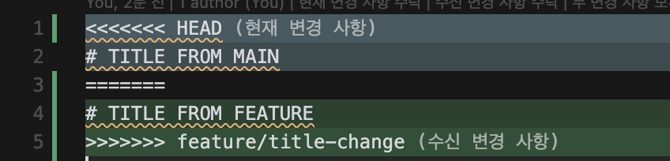

**📸 해결 후 — 마커를 지우고 `# TITLE FROM MAIN` 한 줄로 정리**

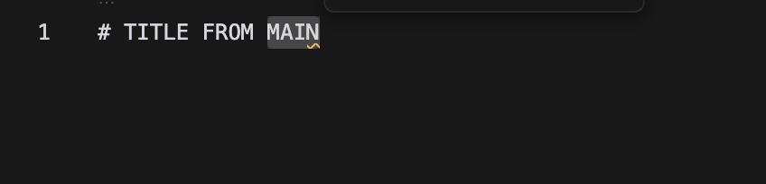

**📸 충돌 발생~해결 전체 터미널 화면**

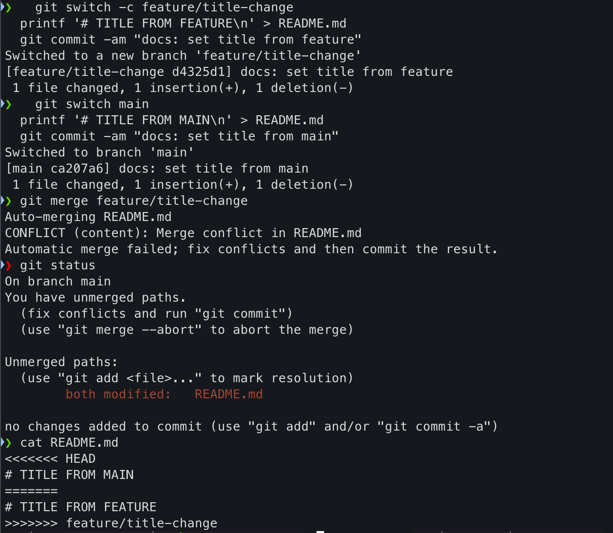

- 배운 점: `<<<<<<<`~`=======` 는 **현재 브랜치(HEAD)**, `=======`~`>>>>>>>` 는 **합치려는 브랜치**. 세 마커 줄은 한 글자도 남기면 안 됨.
- 헛디딘 점: 처음엔 `main 수정 → 분기 → feature 수정` 순서라 충돌 없이 **fast-forward** 됨. 원인은 *main이 분기 후 안 움직여서*. 또 main 커밋이 `nothing to commit` 으로 안 되던 적도 있었는데, 이는 *내용이 이미 같아서*였음. → **양쪽이 같은 줄을 다르게 + main 커밋에서 `1 file changed` 확인**이 핵심.

---

## Lab 4 — 충돌 해결 (비자명: rename vs 내용수정 → modify/delete)
- 절차: feature에서 `git mv data.txt info.txt` + line A 수정, main에서는 같은 line A를 다르게 수정 → `git merge`.
- 실제 결과: Git이 rename으로 인식하지 않아 **`CONFLICT (modify/delete): data.txt deleted in feature and modified in HEAD`** 발생 (마커 없음).
- 해결: 옛 이름은 삭제 채택, 새 이름 유지 →
  ```bash
  git rm data.txt
  git add info.txt
  git commit
  ```

**📸 modify/delete 충돌 화면**

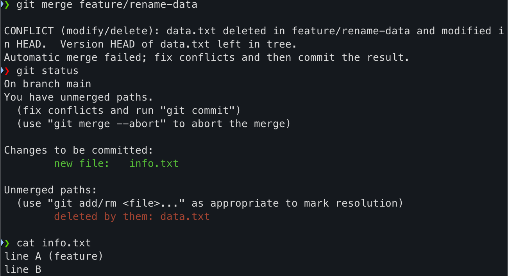

- 배운 점: 모든 비자명 충돌이 마커로 오는 게 아니다. **modify/delete 는 마커가 없고, 파일을 살릴지(`git add`)/지울지(`git rm`)를 *결정*** 하는 방식. 미션 4.7 "이름변경/삭제 vs 내용수정" 비자명 1회 충족.

---

## Lab 5 — `reset --soft HEAD~1`
- 친 명령 / 결과:
  ```text
  git commit -am "wip"              → [main b918039] wip  (일부러 금지 메시지)
  git reset --soft HEAD~1           → 커밋만 취소
  git status                        → Changes to be committed: modified: notes.txt  (변경 살아있음!)
  git commit -m "docs: add work-in-progress notes (재작성)"  → [main ec6d233]
  ```

**📸 reset --soft 전후**

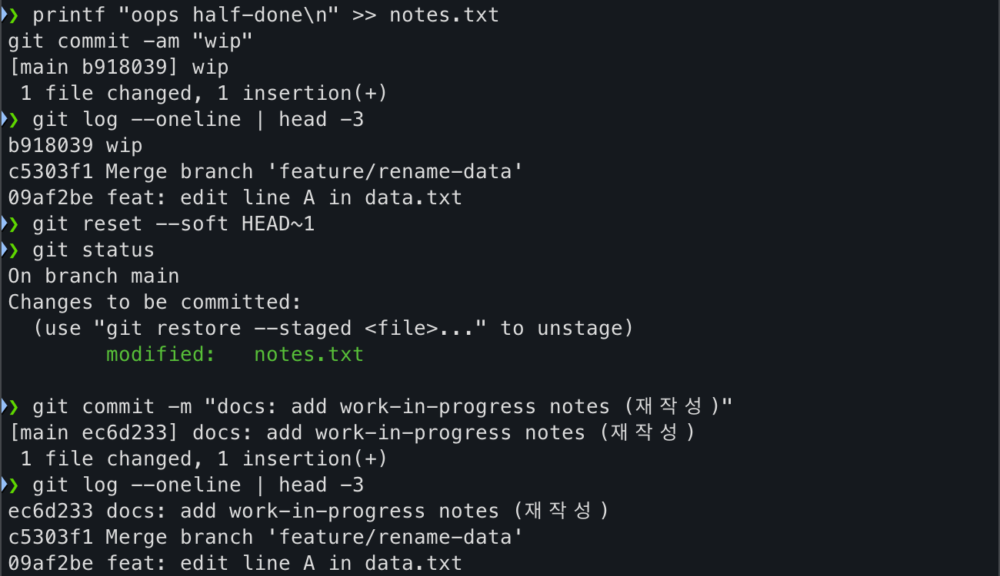

- 배운 점: `--soft` 는 **커밋만 되돌리고 작업 내용은 staged 로 보존**. 그래서 "의미없는 메시지(wip)"를 제대로 된 메시지로 다시 커밋할 때 유용. (`--hard` 였다면 변경까지 삭제됐을 것)

---

## Lab 6 — `revert` (되돌리는 새 커밋)
- 친 명령 / 결과:
  ```text
  printf "BUGGY CHANGE\n" >> notes.txt
  git commit -am "feat: add buggy change"   → [main 11f2d61]
  BAD=$(git rev-parse HEAD)
  git revert --no-edit $BAD                  → [main 81fd762] Revert "feat: add buggy change"  (1 deletion)
  git log --oneline | head -3:
    81fd762 Revert "feat: add buggy change"
    11f2d61 feat: add buggy change           ← 원래 커밋도 그대로 남음
  tail -n3 notes.txt                         → BUGGY CHANGE 사라짐
  ```

**📸 revert 후 히스토리 (원본 + Revert 커밋 둘 다 존재)**

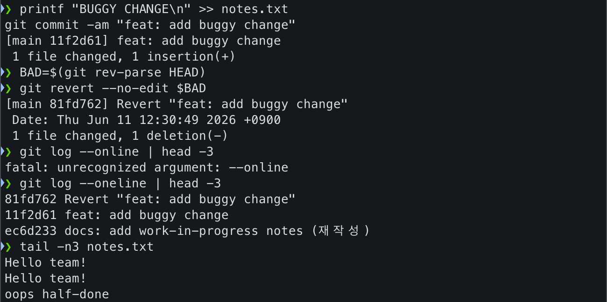

- 배운 점: `revert` 는 **히스토리를 지우지 않고 "되돌리는 커밋"을 새로 추가**. 그래서 이미 push된 공유 커밋을 안전하게 취소할 때 reset 대신 revert를 쓴다.
- 삽질 메모: 처음에 `git log --online` 으로 오타 → `unrecognized argument`. 올바른 건 `--oneline`.

---

## Lab 7 — `stash` / `stash pop`
- 친 명령 / 결과:
  ```text
  printf 'temporary experiment\n' >> notes.txt
  git stash       → Saved working directory and index state WIP on main: 81fd762 Revert ...
  git status      → nothing to commit, working tree clean   (트리 깨끗!)
  git stash list  → stash@{0}: WIP on main: ...
  git stash pop   → 변경 복원, Dropped refs/stash@{0} (7639f674...)
  git checkout -- notes.txt   (실험 변경 정리)
  ```

**📸 stash 전체 흐름**

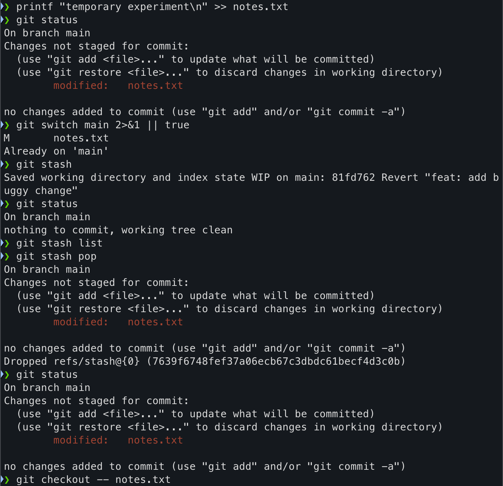

**📸 stash list 확인**

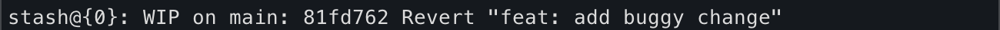

- 배운 점: `stash` 는 커밋하기 애매한 작업을 **선반에 잠깐 올려 트리를 깨끗하게** 만들고, `pop` 으로 되돌린다. 브랜치 전환 전 임시 보관에 유용.

---

## Lab 8 — `commit --amend`
- 친 명령 / 결과:
  ```text
  git commit -m "add verison"               → [main 803bc47]  (오타 메시지)
  git commit --amend -m "feat: add version.txt"  → [main 7df3703]  (해시 바뀜!)
  git log --oneline | head -1               → 7df3703 feat: add version.txt
  ```

**📸 amend 전후 (메시지·해시 교체)**

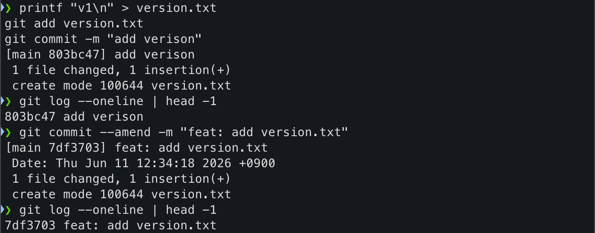

- 배운 점: `--amend` 는 **직전 커밋을 새 커밋으로 교체**(해시 변경). 메시지 오타 교정에 좋지만, **이미 push한 커밋이면** 해시가 바뀌어 강제 푸시가 필요 → 공유 브랜치에선 주의.

---

## Lab 9 — `rebase -i` (squash, 보너스)
- 절차: 지저분한 커밋 3개(`wip a/b/c`)를 만든 뒤 `git rebase -i HEAD~3` → 에디터에서 2·3번째를 `squash` 로 변경.

**📸 rebase 전 (모두 pick)**

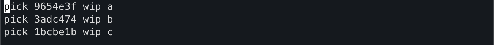

**📸 rebase 편집 (b, c 를 squash 로)**

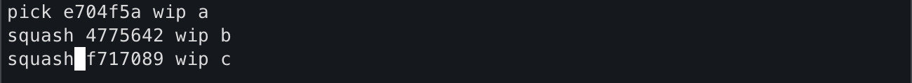

- 배운 점: `pick` → `squash` 로 바꾸면 여러 커밋이 **하나로 합쳐짐**. 개인 feature 브랜치 히스토리 정리에 사용. ⚠️ 공유 브랜치에서는 금지(미션 제약).

---

## Lab 10 — `reflog` 복구 (안전망)
- 친 명령 / 결과:
  ```text
  git reset --hard HEAD~1     → 마지막 커밋 날림(변경까지 삭제), HEAD = 2895fbe
  git reflog | head -5        → HEAD@{0} reset / HEAD@{1} rebase ... 이력 확인
  git reset --hard HEAD@{1}   → 직전 상태로 복구 (9654e3f)
  ```

**📸 reflog 로 날린 커밋 복구**

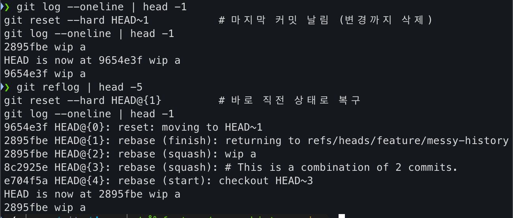

- 배운 점: `--hard` 로 날려도 `reflog` 에 이동 이력이 남아 `HEAD@{n}` 으로 되살릴 수 있다. 실수했을 때의 안전망.

---

## 미션 증빙 연결

> 위 캡쳐/기록이 미션 제출물 어디로 가는지.

| 이 문서의 기록 | 미션 증빙 위치 |
| --- | --- |
| Lab 1~2 log 그래프 | `SUBMISSION.md` evidence / 2장 히스토리 증빙 |
| Lab 3 content 충돌 (`lab3-marker.png`) | `docs/conflict-resolution.md` (4.7) |
| Lab 4 modify/delete 충돌 (`lab4.png`) | `docs/conflict-resolution.md` 비자명 1회 (4.7) |
| Lab 5~8 (`lab5`~`lab8.png`) | `docs/troubleshooting-log.md` 4종 (4.8) |
| Lab 9~10 (rebase/reflog) | 보너스(5장) / 트러블슈팅 보강 |

## 회고 한 줄
- 가장 헷갈렸던 것: 충돌이 **안 나는** 경우들(fast-forward / 자동 머지 / nothing to commit) — 결국 "공통 조상에서 양쪽이 같은 줄을 다르게 + main도 실제로 커밋되어야" 충돌이 난다는 걸 체득.
- 실무에 바로 쓸 것: `reset --soft`(메시지 재작성), `revert`(공유 커밋 취소), `stash`(작업 전환).
